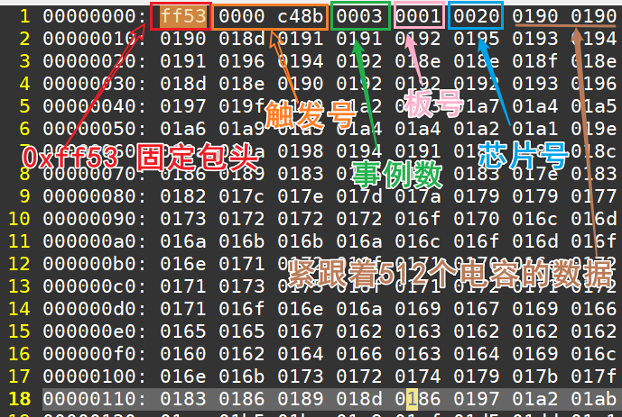
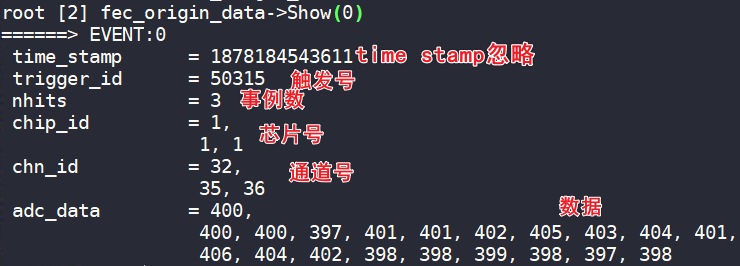

# USTC DCM 数据解包程序

> 目前解包程序适用于所有的新 DCM 板，提供的新 DCM 板均为子母板结构

数据格式说明请见这个文件：[数据格式说明](./doc/data_format.md)

## USB 数据拆分

文件夹：[./source/usb_data_separate](./source/usb_data_separate)

这段程序是为了将 [USB 上位机](../control_software/UsbNewDaq)采集到的数据按照板号进行拆分，其主程序为 [usb_data_seperate.cc](./source/usb_data_separate/usb_data_separate.cc)，不带参数运行程序会显示运行提示。正常情况下直接 ./usb_data_seperate -f [文件名] 即可，如果有多个文件自行用 bash 的 for 循环。

```bash
Usage: ./usb_data_seperate
    -f [data filename]
    -o [output prefix](optional, default: "mt")
    -O [output path](optional, default: ./)
    -M [maximum FEC in use](optional, default: 16)
```

USB 数据格式请见[格式说明](../../doc/data_analysis/data_format.md)，解包程序不会对数据进行预处理，只会将每个板子的数据拼在一起，接下来的过程需要FEC 数据解包程序来完成。

## FEC 数据解包

文件夹：[./source/fec_data_dec](./source/fec_data_dec)

FEC 数据格式请见[格式说明](../../doc/data_analysis/data_format.md)，这个程序会将上一步拆分出来的数据整理和解包，但是并不会对数据具体进行分析。不带参数运行会输出提示。使用时直接使用-f 参数指定第一个文件的文件名。如果只有一个文件就不用指定 -L 参数了。考虑到实际上采数的时候，数据会按照时间段分片，因此可以使用 -L 参数指定后面的文件名，如果是用上一步产生的数据，那么文件名一定是符合规范的；-T/-t 参数用于选择是否保存二进制文件，用于 [MATLAB 程序](./source/matlab_plot/readme.md)分析；-U/-u 参数用于指定是 USB 上位机采集到的数据，这个参数一定要指定（因为这个程序最初是给 FELIX 系统采集到的数据进行分析的）；-o 参数用于指定输出文件的附加名字，默认是在文件名后面加上一个\_out。

```bash
Usage: ./fec_data_dec -[parameter] [options]
    -f [First data filename. If single file, specific the filename] (required)
    -L [Loop number]
    -t/-T <Save finary files for not root process>
    -n [Filename separator. Default: _mt]
    -u/-U <Is data acquired by USB?>
    -o [Save filename suffix] (Default: out)
```

### 二进制文件结构

数据结构如下图所示，每次触发来的事例以 0xFF53 开头，紧接着是 32bits 的触发号，之后是这个触发下面有数据的通道数，接下来就是板号，芯片号以及512个采样电容的数据。这个 [MATLAB 程序](../matlab/mat_fec_plot/read_fec_event.m)可以将数据读入，然后进行下一步的分析。



### root 文件结构

root 文件结构较为简单，如下图所示，TTree的构造函数如下面两个代码所示。如果用 root 分析，请掌握基本的 root 和 c++。

```c++
	out_file = new TFile(data_file_name.c_str(), "recreate");
	data_tree = new TTree("fec_origin_data", "FEC DATA");
	data_tree->Branch("time_stamp", &time_stamp, "time_stamp/L");
	data_tree->Branch("trigger_id", &trigger_id, "trigger_id/I");
	data_tree->Branch("nhits", &nhits, "nhits/I");
	data_tree->Branch("chip_id", chip_id, "chip_id[nhits]/I");
	data_tree->Branch("chn_id", chn_id, "chn_id[nhits]/I");
	data_tree->Branch("adc_data", adc_data, "adc_data[nhits][512]/I");
```

```c++
	TFile* out_file;
	TTree* data_tree;
	long time_stamp = 0;
	int trigger_id = 0;
	int nhits = 0;
	int chip_id[cMAX_HITS];
	int chn_id[cMAX_HITS];
	int adc_data[cMAX_HITS][cSCA_NUM];
```




## 噪声计算

文件夹：[./source/fec_noise_calc](./source/fec_noise_calc)

主程序为 [fec_noise_calc.cc](./source/fec_noise_calc/fec_noise_calc.cc)，这个程序的主要目的是根据采集到的数据分析其噪声大小并做图，其说明如下 -f 参数后面加上噪声文件名，一定要是 .root 后缀的，也就是 fec_data_dec 程序解包出来的结果；-l 参数用于指定 link 编号，最后生成的阈值文件就是靠这个来命名的，同时阈压缩的阈值文件也是这个；-F 参数暂时忽略；-L 参数暂时忽略；-s 参数表示阈值设置为几倍σ；-o 表示画噪声分布图；-U 表示给 USB 上位机生成阈值配置文件；-z 表示只写阈值为零的配置文件。

```bash
Usage:./fec_noise_calc
    -f [Noise file path]
    -l [Link number](If not set, all the file will save with the input filename)
    -F [Loop file suffix]
    -L [Loop number]
    -s [Sigma level]
    -o [is_save_plot]
    -U (Is USB)
    -Z (Write only zero command mode)
```

