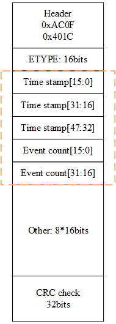
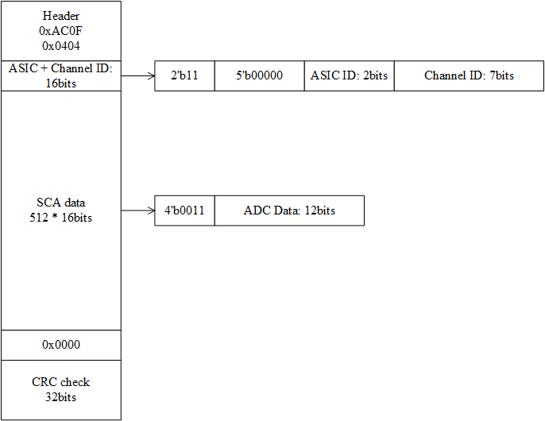
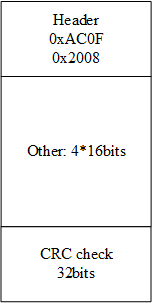
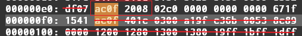
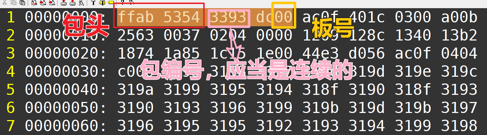
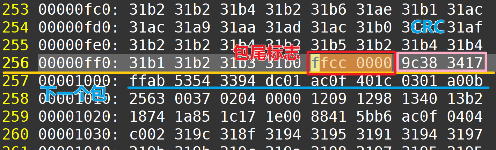

# AGET FEC 数据包

AGET 数据包分为 3 部分：事例头部、事例数据和事例尾部

## 事例头部数据包

头部包含了触发号和时间戳信息，下面简单的把头部的信息表示如下

- 首先是32bits 的包头 0xAC0F 0x401C
- 接下来 16bits 忽略

- 然后是紧跟着 48 bis 的 Time stamp，和 32 bits 的 Event count，多板之间的事例对齐用 Event count
- 接下来的  数据是其他信息，忽略，然后是  的 CRC 校验，忽略

事例头部数据包之后紧跟着数据

## 事例数据

事例数据按照如下格式

- 首先是头 0xAC0F 0x0404
- 然后是 芯片号和通道号

- 接下来是 512 个 SCA 的数据，由于是 12bits ADC，数据高四位被填上了 0011
- 然后是两个 16bits 的 CRC 校验

这是一个芯片的一个通道的数据格式，每块板子总共有 4 片芯片，每片芯片一共有 68 通道（4个噪声通道开启），因此读回的数据应当有518\*68\*4 个 16 bits；如果开启了数据的通道压缩，那么就传输实际的数据包个数

事例数据完了直接就是事例尾部

## 事例尾部

事例尾部表示这次触发的数据已经传输完成，数据一般忽略

接下会跟着的就是下次触发的数据

---

# USB数据格式说明

首先USB的采集方式不会丢掉 FEC 原本产生的数据，全部都原封不动的存了下来，当然也加上了一些包头和包尾。连上包头和包尾，每个包的大小是$1024\times 32bits$的数据，其中包头占 $2\times 32bits$ 。

## 包头格式如下图

1. 首先是固定的 0xffab 0x53（图中的54已经弃用）
2. 紧接着是数据包编号，当前数据包的编号和前后应当是连续的，否则表示丢包了，这个时候应当检查 USB 数据传输部分
3. 接下来是板号部分：0xdc+板号，解包程序将会根据板号来分配数据给不同的板子

中间紧接着的就是 FEC 传输给DAQ的数据

## 包尾数据格式说明

中间会传输$1020\times 32bits$ 的 FEC 采集数据，然后紧跟着是包尾的标志 0xffcc 0x0000（如果传输过程中出现了FIFO满的情况，那就不是0x0000，对应的比特位会被置1），最后两个 32bits 的数据是CRC校验码

